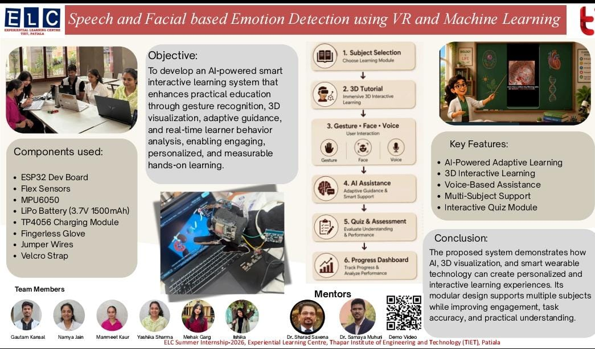

# 🧠 AI 3D Learning Engine

### AI-Powered Interactive Learning System using 3D Visualization, Computer Vision, Gesture Recognition & Adaptive Learning

<p align="center">
  
</p>

<p align="center">
  <b>Making learning interactive, personalized, and immersive through AI, 3D visualization, gesture interaction, and real-time learner analysis.</b>
</p>

<p align="center">
  <a href="https://github.com/yashikasharma2004/ai-3d-learning-engine">
    
  </a>
  
  
  
  
</p>

---

## 🎥 Demo

### ▶️ Working Demonstration

A complete working demonstration of the system is available here:

**[▶️ Watch the 2-Minute Demo Video]((https://drive.google.com/file/d/1CJcCnXZkGSe6fZWK0C-OZE_NaMqPLqV6/view?usp=sharing))**

> The demo showcases the interactive learning workflow, 3D visualization, gesture-based interaction, AI assistance, learner confusion monitoring, adaptive guidance, and quiz/assessment flow.

---

## 📌 Overview

**AI 3D Learning Engine** is an AI-powered interactive learning platform designed to make traditional educational content more engaging through **3D visualization, gesture-based interaction, voice interaction, adaptive learning, and real-time learner analysis**.

The system combines an interactive 3D learning environment with AI-driven assistance to create a more personalized learning experience. Instead of relying only on static textbooks or videos, students can interact with virtual 3D educational models, perform learning tasks, receive contextual guidance, and evaluate their understanding through adaptive assessments.

The platform is designed to support **Biology, Chemistry, and Physics** learning modules, with the demonstrated workflow focusing on interactive Biology learning.

---

## 🎯 Objectives

The primary objective of the project is to develop an **AI-powered smart interactive learning system** that:

* Makes complex concepts easier to understand through interactive 3D visualization.
* Enables students to interact with educational models using gestures.
* Provides AI-assisted explanations and contextual guidance.
* Detects learner confusion and provides adaptive assistance.
* Supports voice-based interaction.
* Generates interactive quizzes and assessments.
* Tracks student learning progress.
* Creates a personalized and engaging hands-on learning experience.

---

## ✨ Key Features

### 🧬 Interactive 3D Learning

* Interactive 3D educational environments.
* Visual exploration of scientific concepts and structures.
* Task-oriented learning instead of passive content consumption.
* Designed for Biology, Chemistry, and Physics learning modules.

### 🖐️ Gesture-Based Interaction

Students can interact with the learning environment using:

* Camera-based hand gestures.
* Optional ESP32-based gesture glove.
* Gesture-driven object selection and interaction.

Hardware is optional, with camera-based interaction available as a fallback.

### 🤖 AI Learning Assistant

The system provides AI-assisted support during learning sessions by:

* Providing contextual guidance.
* Explaining concepts when the learner needs help.
* Supporting adaptive learning interactions.
* Assisting students during interactive tasks.

### 🧠 Real-Time Learner Analysis

The system includes learner-state monitoring to identify potential confusion during the learning process.

When confusion is detected, the system can provide additional assistance or guidance instead of leaving the learner stuck.

### 🎤 Voice Interaction

Voice-based interaction enables a more natural learning experience and allows students to interact with the system without relying completely on traditional mouse/keyboard input.

### 📝 Adaptive Quiz & Assessment

The platform includes an interactive assessment module that:

* Evaluates student understanding.
* Provides quiz-based learning.
* Supports task completion and assessment.
* Connects assessment results with the overall learning workflow.

### 📊 Student Progress Dashboard

The student profile module helps maintain learning-related information and provides a structured view of learner progress and performance.

---

## 🔄 System Workflow

```text
              ┌─────────────────────┐
              │    Student Login    │
              └──────────┬──────────┘
                         │
                         ▼
              ┌─────────────────────┐
              │   Subject Selection │
              │ Biology / Chemistry │
              │      / Physics      │
              └──────────┬──────────┘
                         │
                         ▼
              ┌─────────────────────┐
              │   3D Interactive    │
              │      Tutorial       │
              └──────────┬──────────┘
                         │
              ┌──────────┴──────────┐
              ▼                     ▼
     ┌────────────────┐    ┌────────────────┐
     │ Gesture Input  │    │ Voice / Camera │
     │ ESP32 / Camera │    │    Interaction │
     └───────┬────────┘    └───────┬────────┘
             │                     │
             └──────────┬──────────┘
                        ▼
             ┌─────────────────────┐
             │   AI Assistance &   │
             │ Learner Monitoring  │
             └──────────┬──────────┘
                        │
                        ▼
             ┌─────────────────────┐
             │ Adaptive Guidance / │
             │   Mini Tutorial    │
             └──────────┬──────────┘
                        │
                        ▼
             ┌─────────────────────┐
             │ Quiz & Assessment   │
             └──────────┬──────────┘
                        │
                        ▼
             ┌─────────────────────┐
             │ Student Progress &  │
             │     Dashboard       │
             └─────────────────────┘
```

---

## 🧪 Demonstrated Learning Flow

The working demonstration focuses on an interactive Biology learning workflow.

A typical learning session includes:

1. Student profile/login.
2. Subject and learning module selection.
3. Interactive 3D tutorial.
4. Gesture-based interaction with learning objects.
5. AI-assisted learning guidance.
6. Learner confusion monitoring.
7. Additional explanation when required.
8. Interactive quiz/assessment.
9. Progress tracking.

This workflow demonstrates how AI and interactive visualization can be combined to create a more engaging learning environment.

---

## 🏗️ System Architecture

The project is organized into multiple modules that work together to provide the complete learning experience.

```text
                    ┌─────────────────────┐
                    │   Student / User    │
                    └──────────┬──────────┘
                               │
                               ▼
                    ┌─────────────────────┐
                    │ Desktop Application │
                    └──────────┬──────────┘
                               │
             ┌─────────────────┼─────────────────┐
             │                 │                 │
             ▼                 ▼                 ▼
      ┌─────────────┐   ┌─────────────┐   ┌──────────────┐
      │ 3D Learning │   │   Gesture   │   │    Voice     │
      │   Module    │   │ Recognition │   │ Interaction  │
      └──────┬──────┘   └──────┬──────┘   └──────┬───────┘
             │                 │                 │
             └─────────────────┼─────────────────┘
                               ▼
                    ┌─────────────────────┐
                    │    AI Assistance    │
                    │ & Learner Analysis  │
                    └──────────┬──────────┘
                               │
                ┌──────────────┴──────────────┐
                ▼                             ▼
       ┌────────────────┐             ┌────────────────┐
       │ Adaptive       │             │ Quiz &          │
       │ Guidance       │             │ Assessment      │
       └────────┬───────┘             └────────┬───────┘
                │                              │
                └──────────────┬───────────────┘
                               ▼
                    ┌─────────────────────┐
                    │ Student Profile &   │
                    │ Progress Dashboard  │
                    └─────────────────────┘
```

---

## 🛠️ Technology Stack

### Programming & Application Development

* **Python**
* Desktop application architecture
* REST-style APIs for application services

### 3D & Interactive Learning

* **Three.js**
* Interactive 3D visualization
* Web-based 3D learning components

### AI & Machine Learning

* AI-assisted tutoring
* Adaptive learning logic
* Learner-state/confusion analysis
* Machine learning-based interaction components

### Computer Vision

* Camera-based gesture recognition
* Real-time hand interaction
* Gesture-driven learning tasks

### Hardware Integration

* ESP32 Development Board
* Flex Sensors
* MPU6050
* Li-Po Battery
* TP4056 Charging Module
* Fingerless Glove
* Jumper Wires
* Velcro Strap

---

## 📁 Project Structure

```text
ai-3d-learning-engine/
│
├── integrated_app/
│   ├── ...
│   └── README.md
│
├── quiz/
│   └── ...
│
├── student_profile_module/
│   └── ...
│
├── run_all.py
├── software_preflight.py
├── .gitignore
├── .pre-commit-config.yaml
└── README.md
```

### Main Components

| Component                 | Purpose                                      |
| ------------------------- | -------------------------------------------- |
| `integrated_app/`         | Core interactive learning application        |
| `quiz/`                   | Quiz and assessment functionality            |
| `student_profile_module/` | Student profile and progress functionality   |
| `run_all.py`              | Launches the integrated application services |
| `software_preflight.py`   | Performs software/environment checks         |

---

## ⚙️ Installation & Setup

### 1. Clone the Repository

```bash
git clone https://github.com/yashikasharma2004/ai-3d-learning-engine.git
cd ai-3d-learning-engine
```

### 2. Create a Virtual Environment

On Windows PowerShell:

```powershell
python -m venv integrated_app\venv
```

### 3. Install Dependencies

```powershell
.\integrated_app\venv\Scripts\python.exe -m pip install -r integrated_app\requirements.txt
```

### 4. Run Preflight Checks

```powershell
.\integrated_app\venv\Scripts\python.exe software_preflight.py
```

### 5. Launch the Application

```powershell
.\integrated_app\venv\Scripts\python.exe run_all.py
```

The launcher starts the required application services and then launches the desktop learning application.

> **Hardware is optional.** Camera-based gesture interaction can be used as a fallback when the `GestureGlove` hardware is not connected.

---

## 🧪 Verification

The repository includes tests and validation utilities.

Run the test suite using:

```powershell
cd integrated_app
.\venv\Scripts\python.exe -m unittest discover -s tests -v
```

Task target validation:

```powershell
.\venv\Scripts\python.exe tools\validate_task_targets.py
```

---

## 🔌 Hardware Integration

The system can optionally integrate with a gesture glove built using an ESP32 development board and sensors.

### Hardware Components

* ESP32 Development Board
* Flex Sensors
* MPU6050
* Li-Po Battery
* TP4056 Charging Module
* Fingerless Glove
* Jumper Wires
* Velcro Strap

The hardware enables gesture-based interaction with the learning environment.

For detailed hardware integration information, refer to:

`integrated_app/hardware/GLOVE_INTEGRATION_GUIDE.md`

---

## 🔐 Privacy & Data Handling

The repository intentionally excludes sensitive and generated data.

The following are not intended to be committed:

* API keys
* `.env` files
* Virtual environments
* Raw glove session data
* Caches
* Generated comparison folders
* Frontend dependency folders
* Student-identifiable exports

**Never commit API keys, credentials, or personally identifiable student data to the repository.**

---

## 🚀 Future Scope

The project can be further extended with:

* More comprehensive Biology, Chemistry, and Physics 3D models.
* More advanced learner-state detection.
* Personalized learning paths based on historical performance.
* More sophisticated AI tutoring and explanation generation.
* Additional gesture-based interactions.
* Improved voice interaction.
* VR/AR-based learning experiences.
* Cloud-based student analytics.
* Multi-user classroom analytics.
* Advanced learning-performance visualization.

---

## 🎓 Educational Impact

The system demonstrates how **Artificial Intelligence, Computer Vision, 3D Visualization, Human-Computer Interaction, and Adaptive Learning** can be combined to improve digital education.

By allowing students to interact with learning content rather than simply consuming it, the platform aims to make complex scientific concepts more understandable, engaging, and measurable.

---

## 👥 Team

Developed as part of a **Summer Internship / Experiential Learning project at Thapar Institute of Engineering & Technology (TIET), Patiala**.

### Team Members

* Gaurav Kanwal
* Naman Jain
* Manmeet Kaur
* Yashika Sharma
* Mehak Garg
* Hitesh

### Mentors

* Dr.Sharad Saxena
* Dr.Samya Muhuri

> Update the mentor names above with the exact names shown on the official project poster before publishing.

---

## 📜 Project Status

**Status:** Working Prototype / Academic Project

The current repository contains the integrated application, quiz module, student profile module, software preflight checks, and hardware integration components.

---

## ⭐ Acknowledgements

This project was developed as part of the **Summer Internship / Experiential Learning Program** at **Thapar Institute of Engineering & Technology (TIET)**.

Special thanks to the mentors, team members, and institution for their guidance and support throughout the development of the project.

---

## 📬 Contact

**Yashika Sharma**

* GitHub: [@yashikasharma2004](https://github.com/yashikasharma2004)
* Project Repository: [AI 3D Learning Engine](https://github.com/yashikasharma2004/ai-3d-learning-engine)

---

<p align="center">
  <b>AI + 3D + Computer Vision + Adaptive Learning = A More Interactive Way to Learn 🚀</b>
</p>
